# Spotify User Segmentation & Churn Analysis  
*A Data-Driven Approach to Understanding and Retaining Spotify Users*  

---
## Table of Contents

- [Business Objective](#business-objective)
- [Problem Framing](#problem-framing)
- [Approach](#approach)
- [Exploratory Data Analysis (EDA)](#exploratory-data-analysis-eda)
- [Free User Segmentation](#free-user-segmentation)
- [Premium User Churn Prediction](#premium-user-churn-prediction)
- [Conclusion & Business Insights](#conclusion--business-insights)
---

## Business Objective

According to Spotify’s 2023 annual report, [the Premium Services segment generated **€11.57 billion** and accounted for **87% of total revenue**](https://www.investopedia.com/articles/investing/120314/spotify-makes-internet-music-make-money.asp), underscoring the critical importance of converting free users and retaining paying subscribers. Strengthening Premium adoption is therefore a key driver of long-term profitability and customer lifetime value (CLV).

This project leverages the [*Spotify User Behaviour Dataset*](https://www.kaggle.com/datasets/meeraajayakumar/spotify-user-behavior-dataset/data) from Kaggle to analyse how user behaviours relate to their likelihood of upgrading to Premium or remaining subscribed as Premium users, enabling the identification of key behavioural drivers behind both conversion and retention. The objective is to support data-driven strategies that improve revenue performance and customer lifetime value (CLV).

---

## Problem Framing

Spotify’s revenue growth is heavily dependent on its Premium subscribers. However, based on this dataset, **free users account for 81.5% of the user base with only a ~27% conversion rate, while 18.5% of users are Premium subscribers, of whom approximately one-quarter indicate a likelihood to churn** (see Figure 1 and Table 1). This highlights two parallel business challenges: **low conversion among free users and meaningful churn risk within the Premium segment**.

| Spotify Subscription Plan      | No (%)     | Yes (%)    |
|--------------------------------|------------|------------|
| Free (ad-supported)            | 73.11%     | 26.89%     |
| Premium (paid subscription)    | 25.00%     | 75.00%     |

**Table 1: Current Subcription Plan vs. Percentage of Premium Willingness**  

  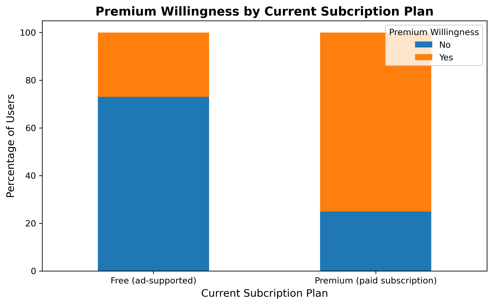
   
  <em>Figure 1: Premium Subscription Willingness Distribution</em>

Because the dataset does not contain direct revenue information, this project uses *willingness to subscribe or continue subscribing (`premium_sub_willingness`)* as a proxy for revenue-related behaviour. The analysis focuses on two key user groups:

- **Free Users:** Identify behavioural drivers of Premium subscription willingness and uncover actionable user segments to enable more targeted and cost-effective marketing interventions (e.g., discounts, family plan promotion).
- **Premium Users:** Find the behavioural indicators of retention willingness and develop churn-prediction models to support personalised recommendations and product strategy enhancements for at-risk users.

To quantify the potential business impact, the analysis is framed around four commercial metrics:

1. **Increase in Customer Lifetime Value (CLV)**
2. **Estimated Annual Recurring Revenue (ARR) preserved**
3. **Incremental revenue from Free → Premium conversion**
4. **Improvement in marketing efficiency (ROI / CAC)**

This framing enables a structured approach to identifying the core behavioural drivers behind conversion and retention.

---

## Approach

### 1. Data Description

**Source:** [Kaggle - Spotify User Behaviour Dataset](https://www.kaggle.com/datasets/meeraajayakumar/spotify-user-behavior-dataset/data)  
**Size:** 520 user records  
**Features:**  
- **Demographics:** Age group, Gender  
- **Behavioural metrics:** Usage duration, listening devices, preferred listening content, preferred music/podcast genre  
- **Subscription data:** Current plan (Free/Premium) and willingness to subscribe or continue subscribing  

[🗂️ View the full dataset description](https://github.com/chienhao-wang/spotify_user_analysis/blob/main/dataset_description.md)

The primary target variable for this analysis is `premium_sub_willingness` (Yes/No)

### 2. Data Cleaning and Preprocessing

All preprocessing steps were performed using `pandas`, including type standardisation, handling missing values, and encoding categorical variables.

- Several survey questions were optional. When missing values occurred in these fields, they were imputed with a **"No Response"** label and treated as a separate response category rather than dropped.
- Multi-response columns (e.g., `spotify_listening_device`, `music_Influencial_mood`) were split using `.str.split(',')`
- A dummy-encoded dataframe was generated to support statistical testing and modelling

### 3. Analytical Methodology

Two analytical tracks were designed for Free and Premium users:

**Free Users**  
- Conducted **Chi-square tests** to identify behavioural features significantly associated with Premium subscription willingness
- Performed **K-means clustering** using the significant variables to uncover meaningful user segments for targeted marketing

**Premium Users**

- Built a **Logistic Regression** model to predict churn likelihood
- **Feature coefficients** were used to evaluate the impact of each behavioural variable:
  - **Positive coefficients (> 0)**: indicate risk factors that increase churn likelihood
  - **Negative coefficients (< 0)**: represent protective factors that enhance retention
- A **coefficient bar chart** was produced to visualise the relative importance of each factor, allowing marketing and product teams to clearly understand which behaviours contribute most to churn or retention.

### 4. Analysis Workflow

1. Conduct EDA to understand Spotify’s conversion and retention challenges
2. Segment Free users to identify high-potential Premium prospects
3. Build a churn prediction model for Premium users
4. Synthesize insights across both user groups
5. Translate findings into actionable recommendations for Spotify’s marketing and product teams

---

## Exploratory Data Analysis (EDA)  

Visualisations were generated using **matplotlib**, **seaborn**, and **squarify** to understand user behaviour patterns.  

### User Overview & Listening Behaviour
- The majority of users are **20–35 years old**, with **female** listeners forming the largest group.  
- Over **75%** stream mainly via **smartphones**, and most have used Spotify for **2+ years**.

  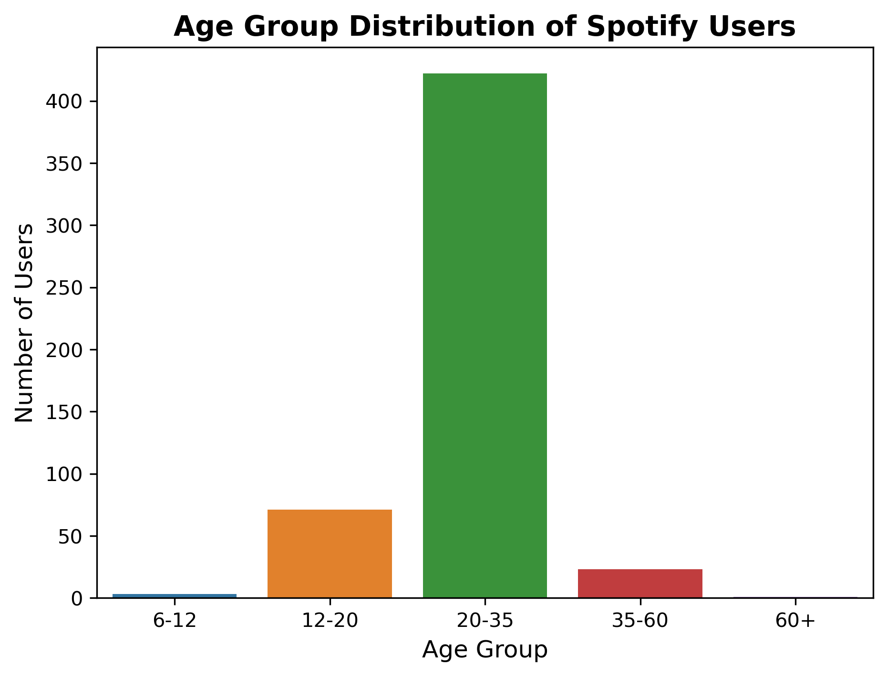
  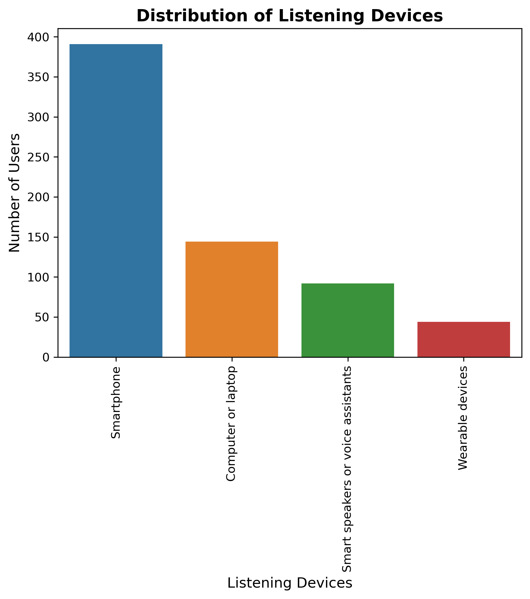
   
  <em>Figure: Age Group & Listening Devices Distribution</em>

### Music Preferences   
- Nearly **80%** primarily listen to **music**, with *Melody*, *Pop*, and *Rap* as top genres.  
- **Night-time** and **workout** are the most popular listening moments.  
- Around **70%** are moderately satisfied with Spotify’s **music recommendations**.

  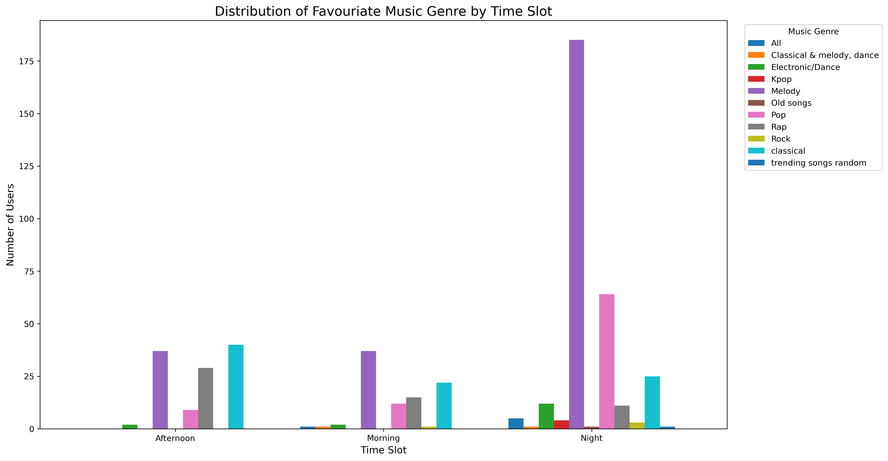
   
  <em>Figure 2: Listeners by Favourite Music Genre and Timeslot</em>

  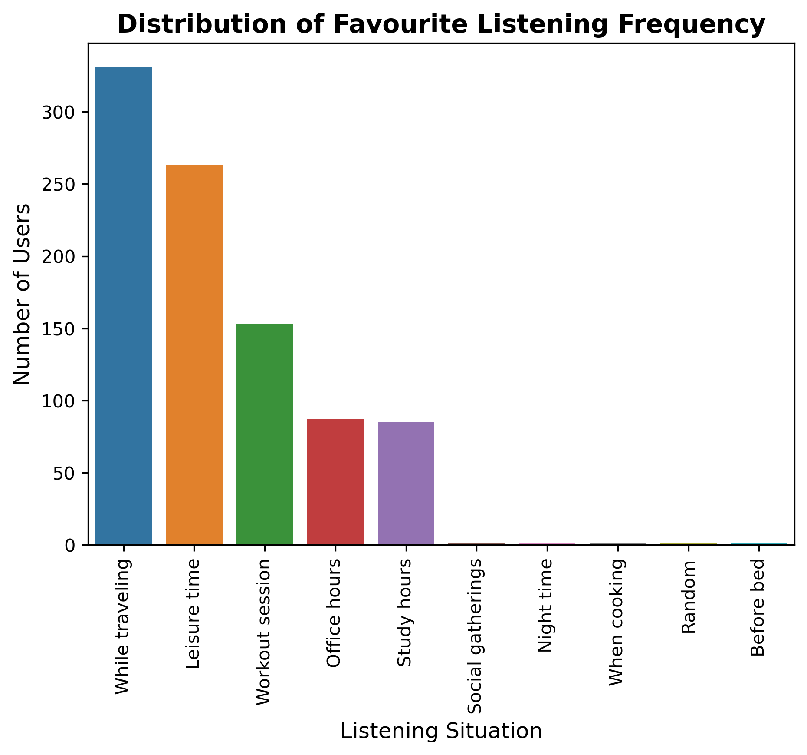
  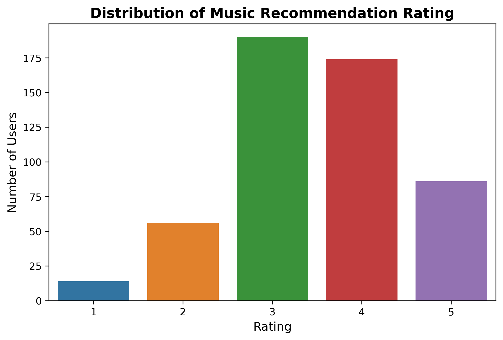
   
  <em>Figure 3: Listeners by Music Listening Frequency and Distribution of Music Recommendation Rating</em>

### Podcast Insights    
- **Podcasts** attract daily listeners, mainly for **short-form comedy or storytelling** content.

  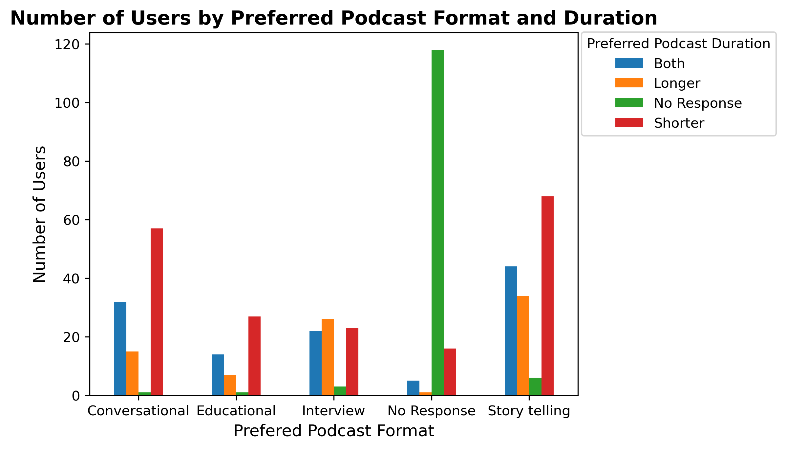
   
  <em>Figure 4: Listeners by Preferred Podcast Format</em>

### Premium Willingness  
- **73%** of free users are unwilling to upgrade, while **75%** of premium users plan to continue — early-stage premium users show the highest churn risk.

  
   
  <em>Figure 5: Premium Subscription Willingness Distribution</em>

[📊 View all charts in EDA](https://github.com/chienhao-wang/spotify_user_analysis/tree/main/EDA_Charts)

## Free User Segmentation 

This section focuses on understanding the behavioural and attitudinal patterns of **free-tier Spotify users** to identify potential converters for Premium plans.  
The analysis combined **exploratory visualisations**, **statistical testing**, and **K-Means clustering** to uncover key drivers of upgrade willingness.  

### Behavioural Analysis  

  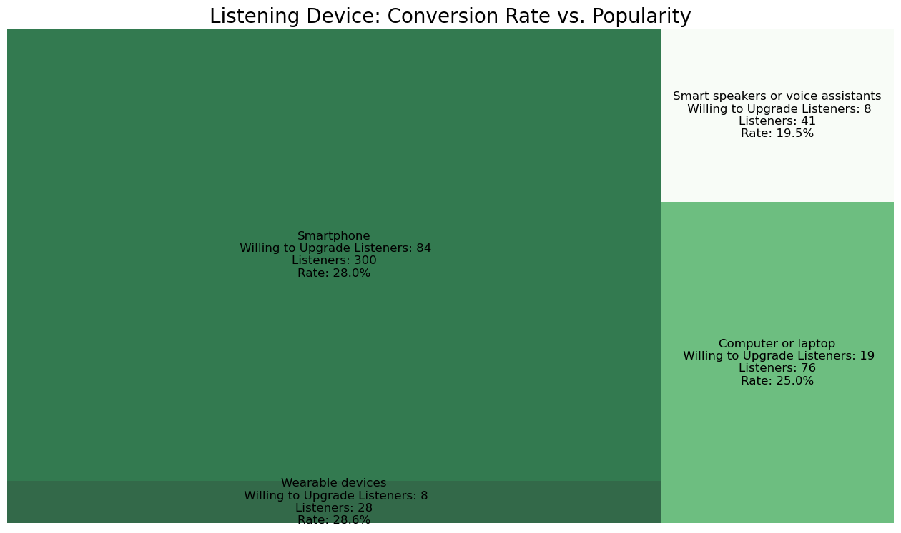
  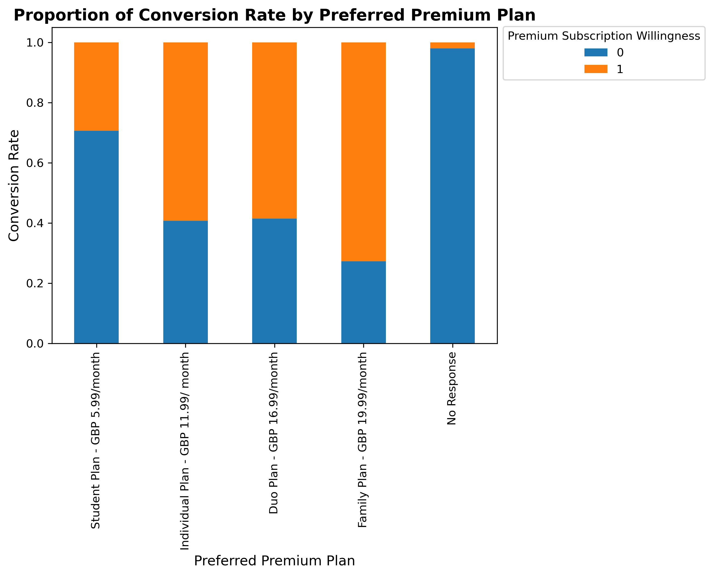
   
  <em>Figure 1–2: Device Usage and Preferred Pricing Plan</em>

- **Device Usage:** Conversion rates are similar across devices, but **smartphone** and **wearable users** show slightly higher upgrade likelihood—suggesting that on-the-go listeners value ad-free and offline features.  
- **Pricing Preferences:** Users lean toward **multi-user plans** (Duo/Family), implying that **cost-per-user** and shared value drive premium adoption decisions.  

  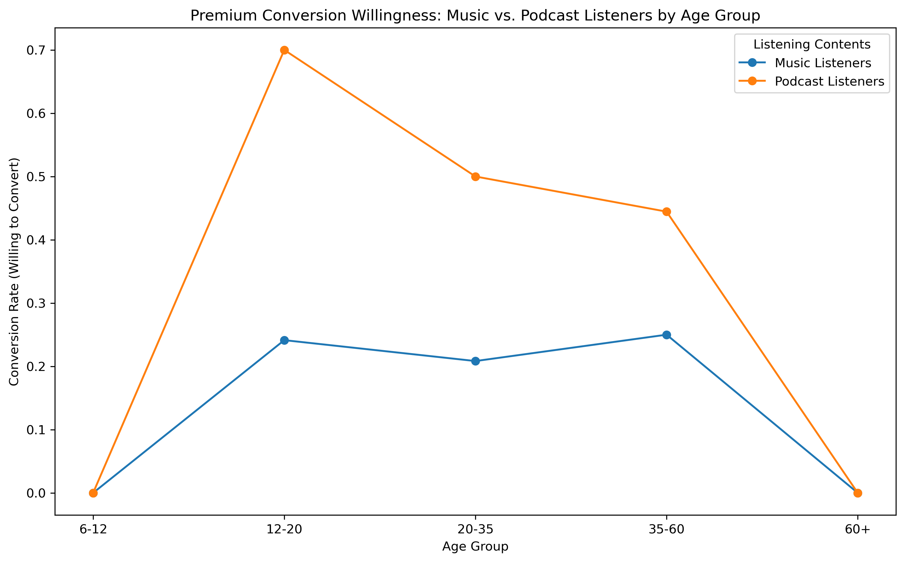
  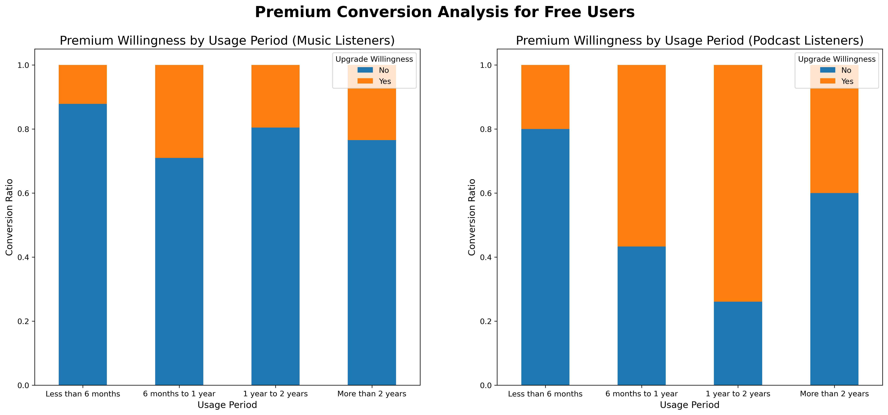
   
  <em>Figure 3–4: Content Type and Tenure Analysis</em>

- **Content Type:** Podcast listeners demonstrate a **stronger upgrade intention** than music listeners, indicating opportunity for **podcast-focused promotions**.  
- **Tenure Effect:** Among podcast users, **1–2 years of active usage** correlates with higher conversion probability, suggesting that long-term engagement supports premium readiness.  

### Music & Podcast Insights  

  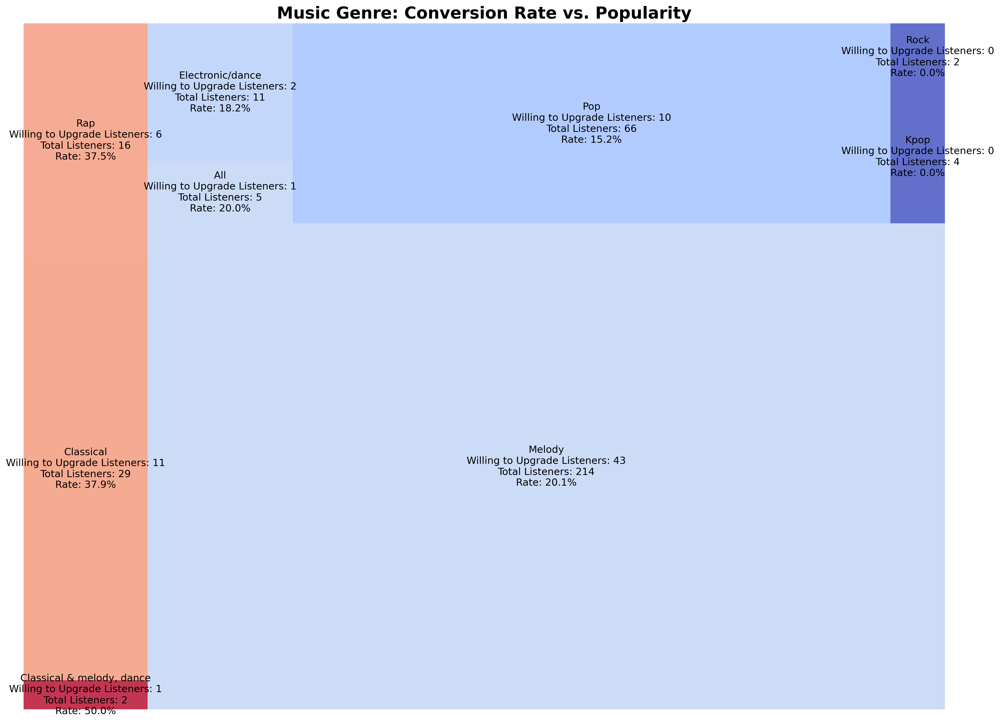
  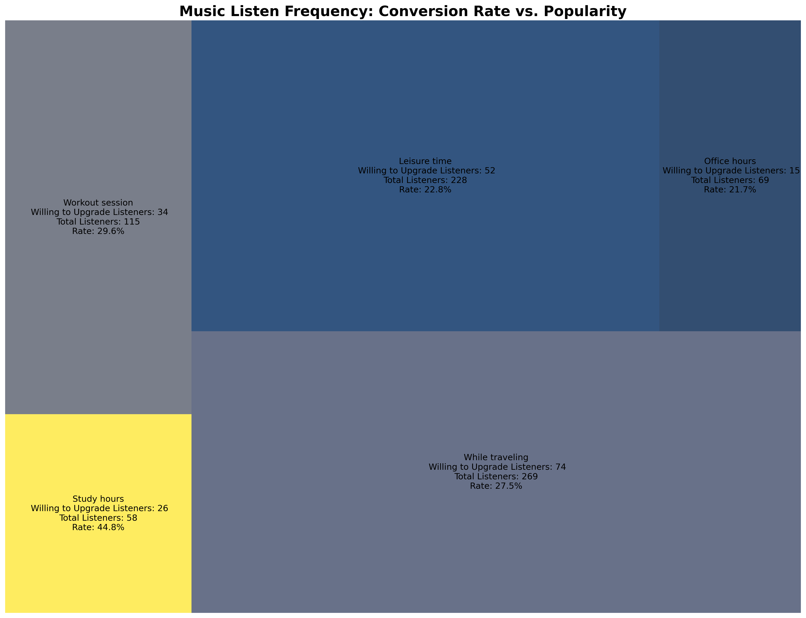
   
  <em>Figure 5–6: Music Genre and Listening Context</em>

- **Music Listeners:** Potential upgraders prefer **Melody**, **Pop**, **Rap**, and **Classical** genres, typically streaming during **afternoon hours**—pointing to genre-time relationships that can inform targeted recommendations.  
- **Listening Context:** Most free users listen **while travelling, relaxing, or studying**, showing Spotify’s role as a **lifestyle companion** for leisure and productivity.  

  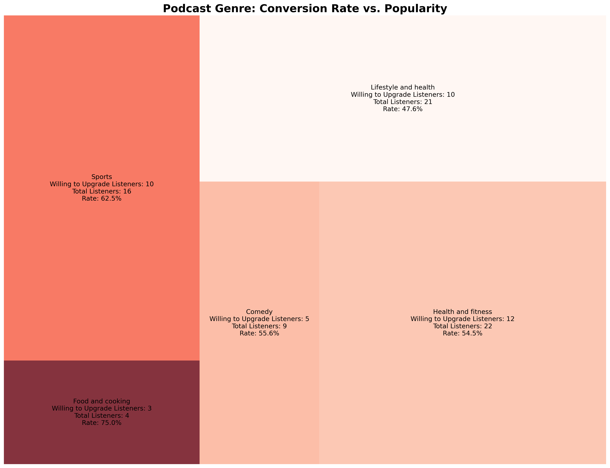
   
  <em>Figure 7: Podcast Genre Conversion</em>

- **Podcast Genres:** Health & Fitness, Sports, and Lifestyle topics exhibit the **highest upgrade rates**, highlighting active and wellness-oriented listeners as strong conversion segments.  

### Statistical Association & Segmentation  

  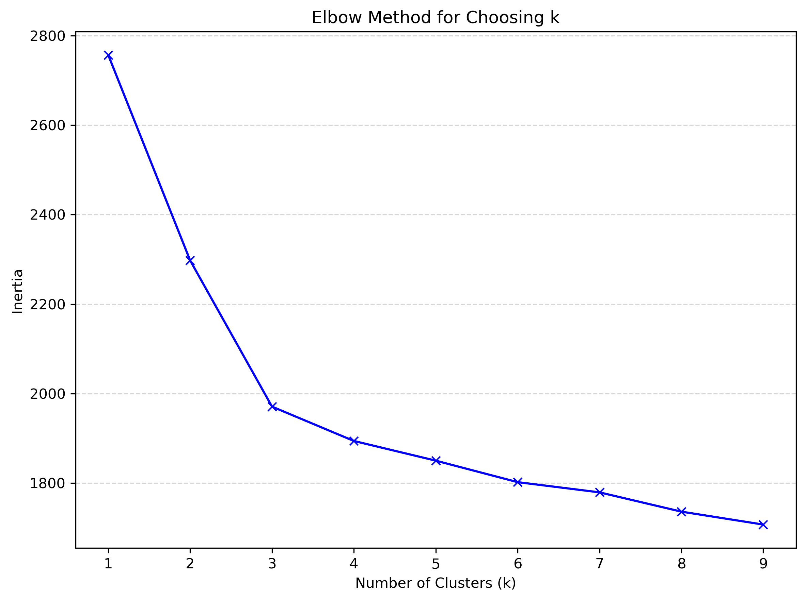
   
  <em>Figure 8: Cramér’s V Correlations</em>

- **Cramér’s V analysis** identified the most influential factors linked to premium willingness:  
  `preferred_premium_plan`, `device_type`, and `fav_music_genre` ranked highest (C > 0.30).  
- Variables with **p < 0.01** from the chi-square test were used in the **K-Means model**, which determined **three behavioural clusters (k = 3)**.

**Cluster Profile:**  
| Cluster | Size | Conversion Rate | Key Traits | Suggested Marketing Actions |
|----------|------|------------------|-------------|------------------------------|
| **0 – Relaxed Streamers** | 218 users | 18% | Mobile-only, listen at night for relaxation or stress relief | Offer affordable *Student/Introductory Plans* and promote mood-based playlists to increase engagement. |
| **1 – Multi-Device Enthusiasts** | 82 users | 63% | Listen across devices (PC, smart speaker, phone), high podcast activity, prefer Duo/Family plans | Target with *premium bundle offers*, emphasising ad-free listening and shared plan value. |
| **2 – Casual Listeners** | 124 users | 20% | Primarily music listeners, lower session frequency, moderate engagement | Retain via *in-app gamification* or personalised reminders to sustain activity. |

**Cluster Insights:**  
- **Cluster 1 – Multi-Device Enthusiasts:** Smallest segment (~82 users) but **most conversion-ready** (> 60% upgrade intention). Frequent podcast listeners, diverse moods, and preference for Duo/Family plans—ideal for targeted Premium offers.  
- **Cluster 0 & 2 – Casual Mobile Listeners:** Mostly **mobile-only**, using Spotify at night for relaxation or stress relief. Low upgrade interest (< 20%), representing the **retention and nurturing group**.  

**Cluster Visualisation**  

### Key Takeaways  

- **Multi-device and podcast engagement** strongly predict premium conversion potential.  
- **Shared plans** and **long-term listening tenure** drive higher upgrade interest.  
- **Cluster 1** represents the prime marketing segment—active, cross-device users with emotional diversity and higher spending power.  
- Future campaigns could focus on promoting **ad-free multi-device access**, **exclusive podcast content**, and **value-driven family plans** to maximise conversion.

---

## Premium User Churn Prediction  

This section analyses **Premium users’ churn behaviour**, exploring how plan type, usage duration, and content preferences affect retention.  
Through **visual exploration**, **statistical testing**, and a **logistic regression model**, this stage identifies the key drivers behind premium churn and potential retention levers.  

---

### Churn Overview  

**Overall Churn Rate:** 25% among Premium users  
**User Distribution:** 72 retained vs. 24 churned  

  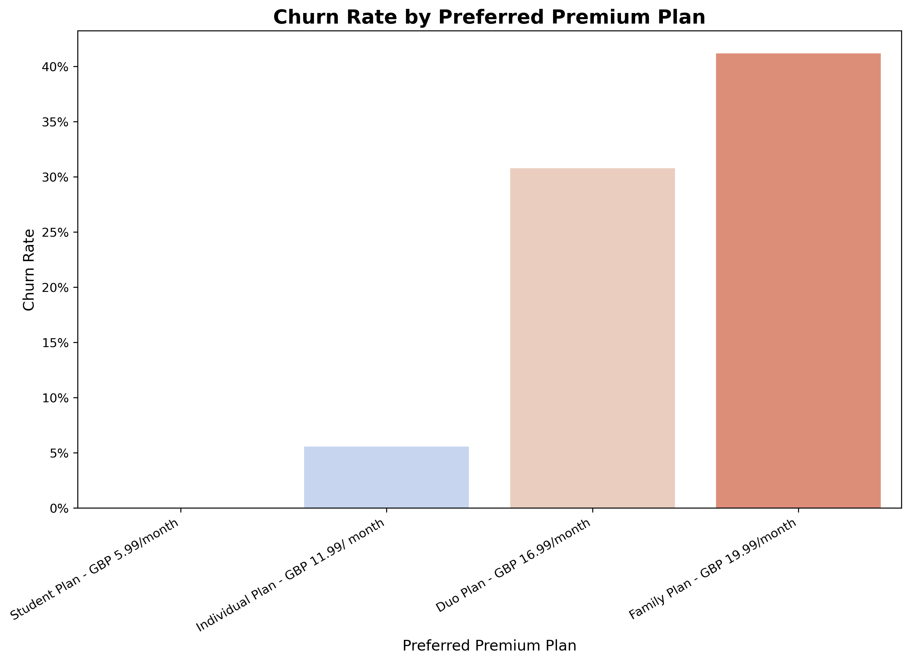
  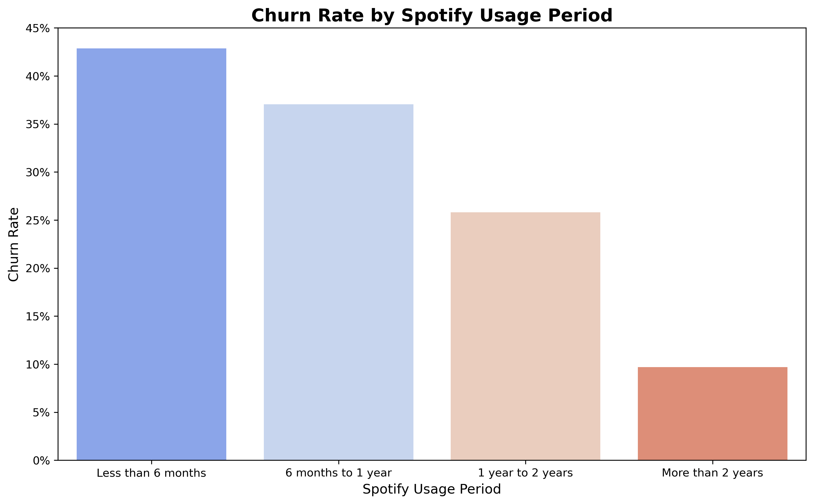
   
  <em>Figure 1–2: Churn Rate by Preferred Premium Plan and Usage Period</em>

**Plan Type:**  
Higher-tier plans such as **Family (£19.99)** and **Duo (£16.99)** show **30–40% churn**, implying potential **price dissatisfaction** or **shared-plan fatigue**.  
In contrast, **Individual** and **Student** plans demonstrate lower churn, indicating **clearer value perception** among solo users.  

**Usage Tenure:**  
Churn rate drops steadily with platform experience — from **over 40% (<6 months)** to **below 10% (>2 years)** — suggesting that **longer usage enhances loyalty**.  

### Content & Engagement Insights  

  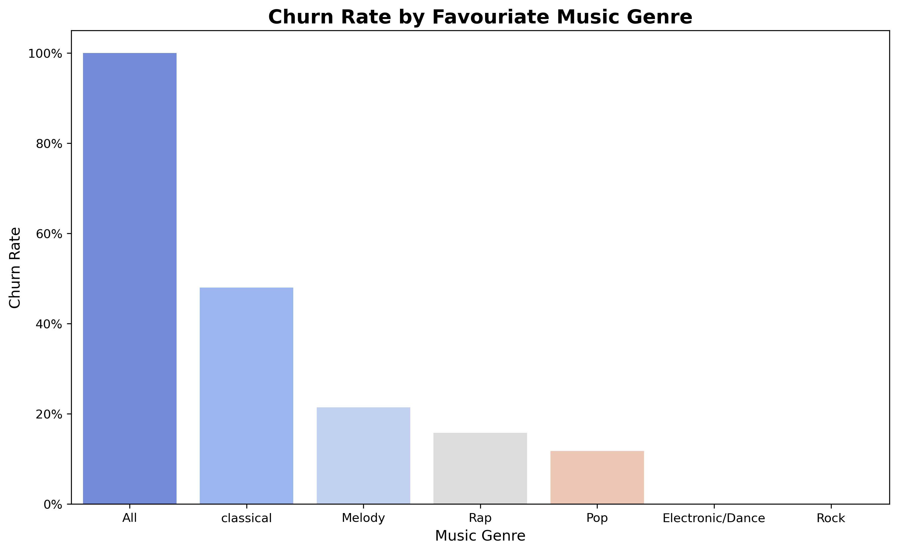
  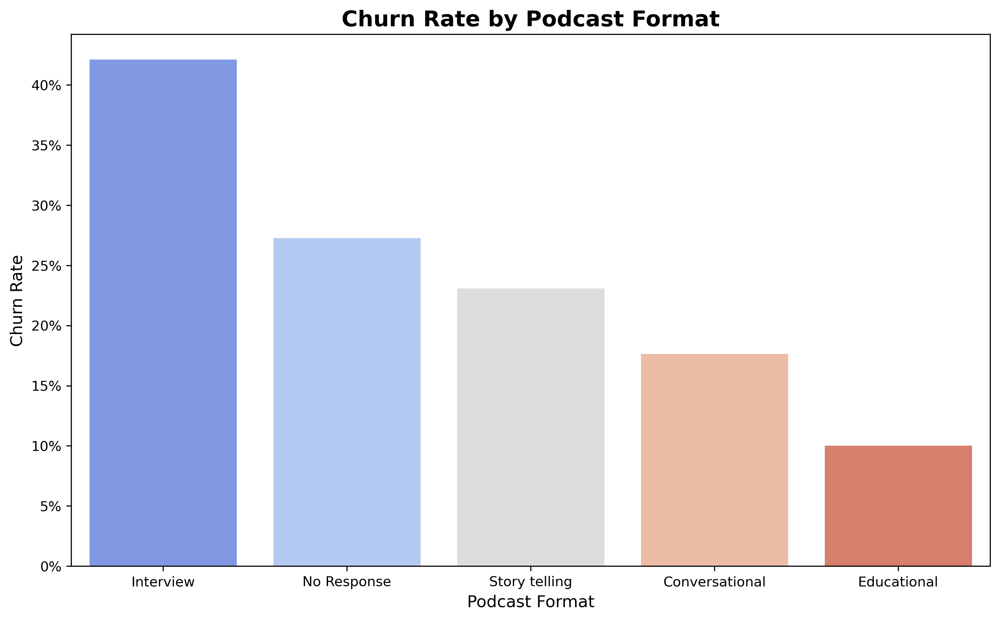
   
  <em>Figure 3–4: Churn Rate by Favourite Music Genre and Podcast Format</em>

**Music Preference:**  
Listeners who prefer **Classical** or **All genres** experience **higher churn**, whereas **Pop** and **Electronic/Dance** fans show **greater retention stability** — indicating stronger engagement among mainstream or upbeat genres.  

**Podcast Format:**  
**Interview-style** podcasts show the **highest churn rate (~42%)**, while **Educational** formats retain users better — highlighting how **knowledge-based content** sustains engagement among premium subscribers.  

### Statistical Modelling  

A **chi-square test** confirmed significant relationships between churn and variables including  
`preferred_premium_plan`, `spotify_usage_period`, and `fav_music_genre` *(p < 0.01)*.  

A **Logistic Regression model** was applied using `class_weight='balanced'` to correct class imbalance.  

**Model Performance:**  
| Metric               | Score |
|----------------------|-------|
| Accuracy             | 0.70  |
| Precision (weighted) | 0.70  |
| Recall (weighted)    | 0.70  |
| F1-score (weighted)  | 0.70  |

  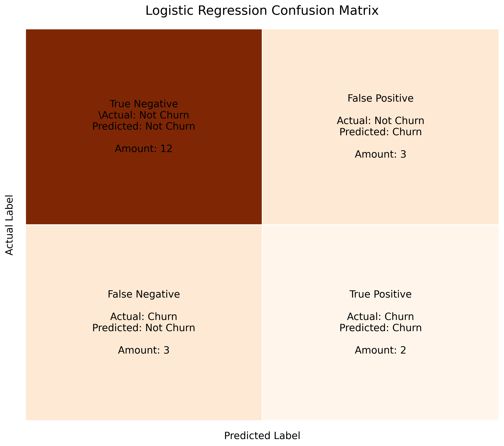
   
  <em>Figure 5: Logistic Regression Confusion Matrix</em>

  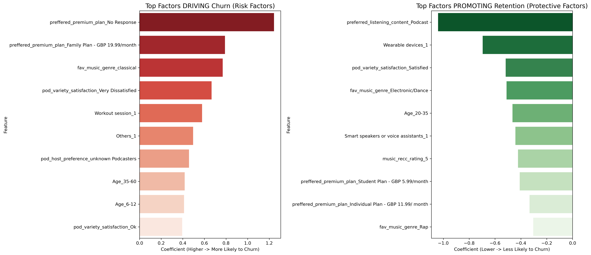
   
  <em>Figure 6: Top Factors Driving and Preventing Churn</em>

| **Risk Drivers (↑ Churn)**             | **Protective Factors (↓ Churn)** |
|----------------------------------------|----------------------------------|
| Family / Duo plans                     | Podcast-preferring users         |
| Classical music fans                   | Wearable device users            |
| Very dissatisfied with podcast variety | Age 20–35                        |
| Workout-session listeners              | High music recommendation rating |
| Unknown podcast hosts                  | Student / Individual plan users  |

### Key Findings  

- **High-tier plans** face **elevated churn** due to shared-account fatigue and cost sensitivity.  
- **Retention strengthens with tenure** — long-term users are less likely to churn.  
- **Podcast satisfaction** is a major retention factor; dissatisfaction significantly predicts churn.  
- **Younger, wearable-device users** show **low churn**, reflecting tech-adaptive engagement patterns.  

### Marketing Implications  

- **Reposition Family & Duo Plans:** Reinforce shared value with group playlists or family rewards.  
- **Enhance Early-Stage Retention:** Improve onboarding, deliver personalised recommendations, and introduce loyalty incentives within the first 6 months.  
- **Optimise Content Strategy:** Promote *educational* podcasts and *electronic/pop* genres to enhance engagement among at-risk subscribers.  

---
## Conclusion & Business Insights  

### Strategic Summary  
Through comprehensive behavioural segmentation and churn modelling, this analysis reveals clear pathways for **increasing Spotify’s conversion rate** and **reducing subscriber attrition**.  
Data-driven marketing actions can be tailored to specific audience clusters to optimise both **growth** and **retention** outcomes.  

---

### 1. **Free User Insights – Converting Intent into Action**  
- **Multi-Device Enthusiasts** (Cluster 1) represent the **highest conversion potential** (> 60%) due to their cross-device activity and preference for Duo/Family plans.  
  → *Target with ad-free multi-device bundles and exclusive podcast access to drive upgrades.*  
- **Casual Mobile Listeners** (Clusters 0 & 2) show low upgrade intention (< 20%) but high nightly usage.  
  → *Engage through mood-based playlists, gamified challenges, and affordable student or introductory offers.*  
- **Podcast engagement** strongly correlates with willingness to upgrade.  
  → *Expand podcast-focused campaigns and highlight offline listening benefits for commuters and gym users.*  

---

### 2. **Premium User Insights – Strengthening Retention**  
- **Churn Concentration:** High-tier plans (Family & Duo) face **30–40 % churn**, mainly from cost sensitivity and shared-plan fatigue.  
  → *Introduce family reward points or shared playlists to reinforce value perception.*  
- **Tenure Loyalty Effect:** Churn falls sharply after 2 years of usage, showing that early-stage retention tactics (onboarding, loyalty points, trial extensions) are vital.  
- **Content Impact:** *Educational* and *Pop/Electronic* listeners exhibit the strongest retention, while *Classical* and *Interview-style podcast* users are most at risk.  
  → *Rebalance algorithmic recommendations and create curated “knowledge-based” or upbeat playlists for at-risk cohorts.*  

---

### 3. **Commercial Implications**  
| Objective | Data-Driven Action | Expected Impact |
|------------|-------------------|-----------------|
| **Increase Free-to-Premium Conversion** | Promote Duo/Family plans to Cluster 1 with ad-free podcast bundles | +15–20 % conversion uplift |
| **Reduce Early-Stage Churn** | Personalised onboarding, push notifications, and satisfaction tracking | Lower 6-month churn by > 10 % |
| **Enhance Long-Term Retention** | Introduce loyalty incentives and multi-device continuity features | Increase lifetime value across cohorts |
| **Optimise Content Strategy** | Prioritise podcast satisfaction and genre diversity in recommendations | Strengthen platform stickiness |
