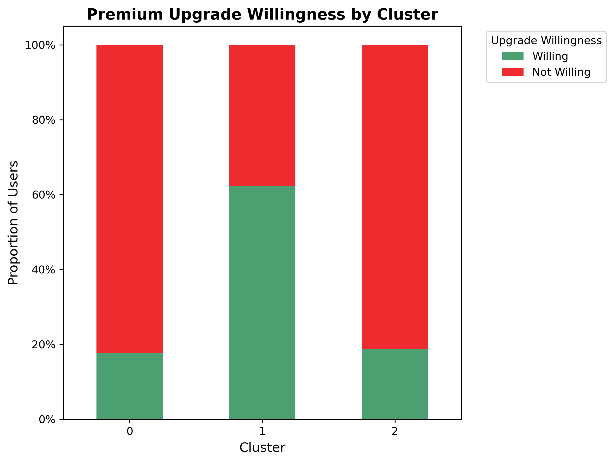
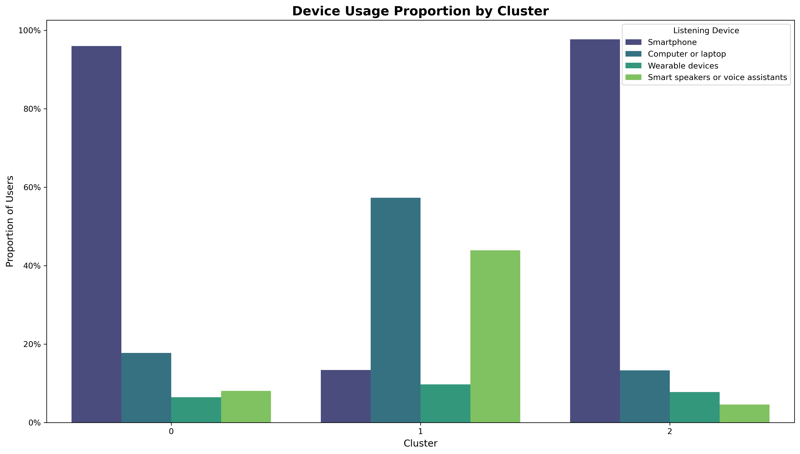
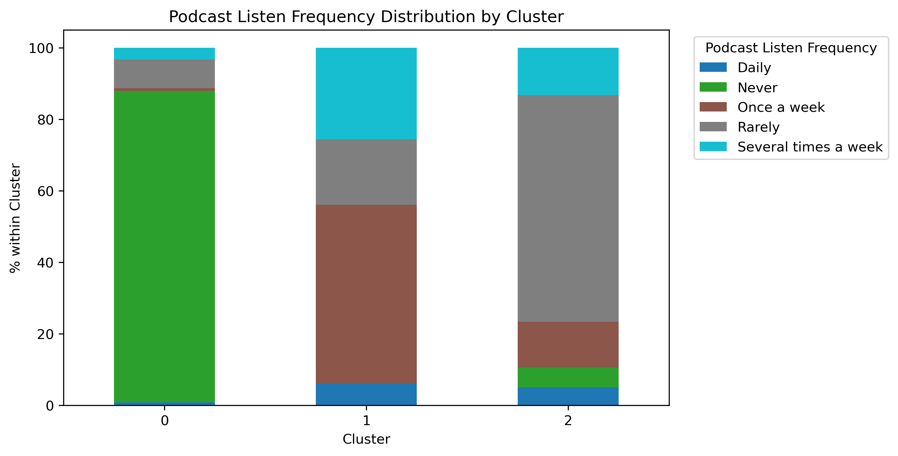
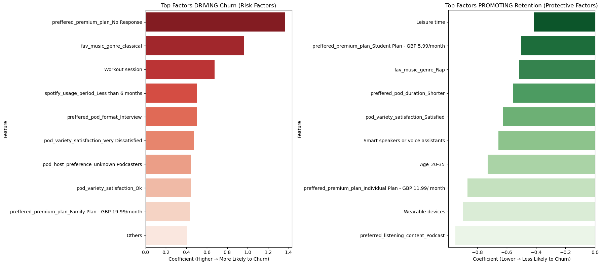

# Spotify User Segmentation & Churn Analysis  
*A Data-Driven Approach to Understanding and Retaining Spotify Users*  

---
## Table of Contents

- [Business Objective](#business-objective)
- [Problem Framing](#problem-framing)
- [Approach](#approach)
- [Key Findings](#key-findings)
- [Recommendations](#recommendations)
- [Business Impact](#business-impact)
- [Next Steps](#next-steps)

---

## Business Objective

According to Spotify’s 2023 annual report, [the Premium Services segment generated **€11.57 billion** and accounted for **87% of total revenue**](https://www.investopedia.com/articles/investing/120314/spotify-makes-internet-music-make-money.asp), underscoring the critical importance of converting free users and retaining paying subscribers. Strengthening Premium adoption is therefore a key driver of long-term profitability and customer lifetime value (CLV).

This project leverages the [*Spotify User Behaviour Dataset*](https://www.kaggle.com/datasets/meeraajayakumar/spotify-user-behavior-dataset/data) from Kaggle to analyse how user behaviours relate to their likelihood of upgrading to Premium or remaining subscribed as Premium users, enabling the identification of key behavioural drivers behind both conversion and retention. The objective is to support data-driven strategies that improve revenue performance and customer lifetime value (CLV).

---

## Problem Framing

Spotify’s revenue growth is heavily dependent on its Premium subscribers. However, based on this dataset, **free users account for 81.5% of the user base with only a ~27% conversion rate, while 18.5% of users are Premium subscribers, of whom approximately one-quarter indicate a likelihood to churn** (see Figure 1 and Table 1). This highlights two parallel business challenges: **low conversion among free users and meaningful churn risk within the Premium segment**.

| Spotify Subscription Plan      | No (%)     | Yes (%)    |
|--------------------------------|------------|------------|
| Free (ad-supported)            | 73.11%     | 26.89%     |
| Premium (paid subscription)    | 25.00%     | 75.00%     |

**Table 1: Current Subscription Plan vs. Percentage of Premium Willingness**  

  
   
  <em>Figure 1: Premium Subscription Willingness Distribution</em>

Because the dataset does not contain direct revenue information, this project uses *willingness to subscribe or continue subscribing (`premium_sub_willingness`)* as a proxy for revenue-related behaviour. The analysis focuses on two key user groups:

- **Free Users:** Identify behavioural drivers of Premium subscription willingness and uncover actionable user segments to enable more targeted and cost-effective marketing interventions (e.g., discounts, family plan promotion).
- **Premium Users:** Find the behavioural indicators of retention willingness and develop churn-prediction models to support personalised recommendations and product strategy enhancements for at-risk users.

To quantify the potential business impact, the analysis is framed around four commercial metrics:

1. **Increase in Customer Lifetime Value (CLV)**
2. **Incremental revenue from Free → Premium conversion**
3. **Improvement in marketing efficiency (ROI / CAC)**

This framing enables a structured approach to identifying the core behavioural drivers behind conversion and retention.

---

## Approach

### 1. Data Description

**Source:** [Kaggle - Spotify User Behaviour Dataset](https://www.kaggle.com/datasets/meeraajayakumar/spotify-user-behavior-dataset/data)  
**Size:** 520 user records  
**Features:**  
- **Demographics:** Age group, Gender  
- **Behavioural metrics:** Usage duration, listening devices, preferred listening content, preferred music/podcast genre  
- **Subscription data:** Current plan (Free/Premium) and willingness to subscribe or continue subscribing  

[🗂️ View the full dataset description](https://github.com/chienhao-wang/spotify_user_analysis/blob/main/dataset_description.md)

The primary target variable for this analysis is `premium_sub_willingness` (Yes/No).

### 2. Data Cleaning and Preprocessing

All preprocessing steps were performed using `pandas`, including type standardisation, handling missing values, and encoding categorical variables.

- Several survey questions were optional. When missing values occurred in these fields, they were imputed with a **"No Response"** label and treated as a separate response category rather than dropped.
- Multi-response columns (e.g., `spotify_listening_device`, `music_Influencial_mood`) were split using `.str.split(',')`
- A dummy-encoded dataframe was generated to support statistical testing and modelling

### 3. Analytical Methodology

Two analytical tracks were designed for Free and Premium users:

**Free Users**  
- Conducted **Chi-square tests** to identify behavioural features significantly associated with Premium subscription willingness
- Performed **K-means clustering** using the significant variables to uncover meaningful user segments for targeted marketing

**Premium Users**

- Built a **Logistic Regression** model to predict churn likelihood
- **Feature coefficients** were used to evaluate the impact of each behavioural variable:
  - **Positive coefficients (> 0)**: indicate risk factors that increase churn likelihood
  - **Negative coefficients (< 0)**: represent protective factors that enhance retention
- A **coefficient bar chart** was produced to visualise the relative importance of each factor, allowing marketing and product teams to clearly understand which behaviours contribute most to churn or retention.

### 4. Analysis Workflow

1. Conduct EDA to understand Spotify’s conversion and retention challenges
2. Segment Free users to identify high-potential Premium prospects
3. Build a churn prediction model for Premium users
4. Synthesise insights across both user groups
5. Translate findings into actionable recommendations for Spotify’s marketing and product teams

---

## Key Findings

### Free Users – Conversion Potential

- After statistical testing and K-means clustering, free users were segmented into **three distinct clusters** (see Figure 2). Among them, **Cluster 1 emerges as the high-potential segment**, with an estimated **62% conversion rate**, representing roughly **51 users** who are willing to upgrade to Premium.  
- **Cluster 2**, while accounting for only **18.8%** of free users, still contains around **40 users with Premium upgrade intent**, making it a meaningful secondary target segment.

  
   
  <em>Figure 2: Conversion Willingness by Cluster</em>

**Behavioural profile of high-potential users (Cluster 1):**

- Cluster 1 users show **significant usage across multiple devices** (see Figure 3): around **57% on desktop** and **44% on smart speakers**, whereas other clusters are heavily concentrated on smartphones (over 95%). This indicates a **multi-device, multi-context listening pattern**.
- They show a strong preference for **Duo and Family plans (≈66%)**, suggesting frequent use of shared household devices or a clear interest in cost-effective family/shared subscriptions.

  
   
  <em>Figure 3: Listening Device Proportion by Cluster</em>

**Content and listening preferences:**

- High-potential users are particularly drawn to **emotion-driven music**, notably *uplifting and motivational* (≈45.12%) and *sadness and melancholy* (≈46.34%).
- They tend to listen **in the morning and afternoon**, and prefer exploring content via **radio and curated playlists**, which together account for **over 60%** of their music discovery behaviour.

**Podcast behaviour:**

- Users who enjoy podcasts generally show **higher Premium upgrade willingness**. Within Cluster 1, **around 75% listen to podcasts at least once per week** (see Figure 4).
- Their preferred podcast genres are **health and lifestyle related** (including *health and fitness*, *sports*, and *lifestyle and health*), representing **around 80%** of their choices. They also tend to favour **longer podcast episodes**, indicating strong engagement with in-depth content.

  
   
  <em>Figure 4: Podcast Listen Frequency Distribution by Cluster</em>

  

---

### Premium Users – Churn Risk and Protective Factors

Insights from the Logistic Regression coefficient bar chart (see Figure 5) reveal that:

- **Premium users on Family plans exhibit elevated churn risk**, making them a critical high-risk group that may be more likely to cancel their subscription.
- Users who are **dissatisfied with podcast variety or rate it as only “okay”** show a **higher likelihood of churn**. In contrast, those who **enjoy podcasts and are satisfied with the variety** demonstrate **significantly lower churn risk**, positioning podcast experience as a key protective factor.

**Music and device usage patterns:**

- Premium users who favour **rap, electronic, or dance** genres are more likely to **continue their subscription** and tend to give **higher ratings to Spotify’s music recommendations**.
- Users who **frequently listen via wearable devices or smart speakers** also show **stronger retention tendencies and lower churn risk**, suggesting that deep, cross-device engagement is closely linked to stickiness and long-term subscription behaviour.

  
   
  <em>Figure 5: Logistic Regression Model Coefficient Bar Chart</em>

---

## Recommendations

### For Free Users — Improving Conversion

**1. Position Spotify as a multi-context experience (home, friends, couples).**  
High-potential free users show strong multi-device and multi-context behaviours and a clear preference for Duo and Family plans. Spotify should reinforce brand messaging around shared, emotional, and social listening moments — such as family time, gatherings with friends, or couple activities — to increase emotional resonance and perceived value.

**2. Personalise content recommendations based on behavioural patterns.**  
Cluster 1 users prefer uplifting, relaxing, and melancholy music, particularly during afternoon listening sessions.  
Recommended actions:  
- Increase afternoon promotion of these genres  
- Use radio and curated playlists as the primary delivery channels  
This improves relevance and nudges users toward Premium features such as ad-free discovery.

**3. Target podcast listeners with focused conversion campaigns.**  
With over 75% of high-potential users listening to podcasts weekly, this is a key audience for efficient acquisition.  
Recommended actions:  
- Deliver Premium discount codes or upgrade prompts to this group  
- Promote health and lifestyle-related podcasts that align with their preferences  
- Use contextual podcast ads highlighting Premium benefits  
This maximises ROI by focusing on users with the highest upgrade intent.

---

### For Premium Users — Reducing Churn Risk

**1. Improve the Family Plan experience for high-risk subscribers.**  
Family Plan users exhibit elevated churn likelihood, suggesting unmet expectations in shared usage.  
Recommended actions:  
- Conduct periodic surveys to capture household needs  
- Enhance family-oriented product features (e.g., shared queue, improved device linking)  
- Boost engagement among inactive family members with personalised recommendations  
This helps stabilise one of the most valuable subscription cohorts.

**2. Strengthen podcast diversity and satisfaction — a key retention lever.**  
Podcast variety satisfaction is one of the strongest protective factors against churn.  
Recommended actions:  
- Expand partnerships with podcast creators, especially in health and lifestyle categories  
- Increase catalogue depth and improve discovery algorithms  
- Introduce Premium-exclusive podcast experiences  
Enhancing podcast quality directly reduces churn probability.

**3. Encourage deeper multi-device engagement.**  
Users who frequently listen via wearables or smart speakers are significantly more likely to remain subscribed.  
Recommended actions:  
- Launch cross-device engagement campaigns  
- Offer exclusive playlists or features for IoT devices  
- Strengthen integrations with major wearable and speaker ecosystems  
Building multi-device habits reinforces long-term retention.

---

## Business Impact

This section quantifies how behavioural segmentation and churn modelling translate into measurable commercial value for Spotify across three dimensions: **Customer Lifetime Value uplift, incremental conversion revenue, and marketing cost efficiency.**

---

### 1. Customer Lifetime Value (CLV) Uplift

## Metrics Spotlight — Understanding CLV Uplift

Reducing churn—even by a small margin—significantly extends customer lifetime and increases long-term revenue.  
This metric quantifies the financial impact of applying model-driven retention interventions.

### **Why It Matters**
- Customer Lifetime Value (CLV) is inversely related to churn:  
  **Lifetime = 1 / Monthly Churn Rate**
- A small reduction in churn produces a disproportionately large increase in lifetime value.
- This metric directly connects model performance → marketing effectiveness → financial impact.

### **Inputs Used in the Calculation**

| Component | Value |
|----------|-------|
| **ARPU** | £4.04 per user per month |
| **Current Monthly Churn Rate** | 25% |
| **Model Recall** | 60% |
| **Marketing Success Rate** | 15% |

### **How the Metric Is Calculated**

1. Churn Reduction = Recall × Marketing Success Rate  
2. New Churn Rate = Current Churn Rate × (1 − Churn Reduction)  
3. Current Lifetime = 1 / Current Churn Rate  
4. New Lifetime = 1 / New Churn Rate  
5. CLV Uplift = (New Lifetime − Current Lifetime) × ARPU  

### **Results**

- **Current Lifetime:** 4.00 months  
- **New Lifetime:** 4.40 months  
- **CLV Uplift per User:** **£1.60**

A reduction in churn from **25% → 22.75%** produces a **£1.60 uplift per Premium user**.

If Recall improves to 80%, the uplift increases to **£2.2**.

Applied to **10,000 Premium users**, this represents:

> **£16,000 in incremental long-term customer value.**

---

### 2. Free → Premium Conversion Revenue

## Metrics Spotlight — Revenue from Targeted Conversion

Targeting high-intent free users significantly increases Premium subscription revenue.  
This metric quantifies the incremental revenue gained by improving conversion rates within the most promising cluster.

### **Why It Matters**
- Not all free users have equal upgrade potential.  
- Focusing marketing on high-intent segments (Cluster 1) maximises revenue efficiency.
- Even small improvements in conversion yield meaningful financial results at scale.

### **Inputs Used in the Calculation**

| Component | Value |
|----------|-------|
| **Cluster Size (High-Potential Users)** | 82 users |
| **Baseline Conversion Rate** | 62.2% |
| **Target Conversion Rate (Post-intervention)** | 67.2% |
| **Incremental Conversions** | +4 users |
| **ARPU** | £4.04 |

### **How the Metric Is Calculated**

1. Baseline Converters = Cluster Size × Baseline Rate  
2. New Converters = Cluster Size × Target Rate  
3. Incremental Conversions = New − Baseline  
4. Monthly Revenue Uplift = Incremental Conversions × ARPU  
5. Annual Revenue Uplift = Monthly Uplift × 12  

### **Results**

- **Monthly Incremental Revenue:** £16.56  
- **Annual Incremental Revenue:** £198.77  

When extrapolated to **100,000 free users** with similar behavioural characteristics, the total uplift scales to:

> **£46,879.25 in annual incremental Premium revenue.**

---

### 3. Marketing Cost Efficiency (ROI / CAC)

## Metrics Spotlight — Reducing CAC Through Targeted Marketing

Segmentation enables Spotify to allocate marketing spend more efficiently by focusing on users with the highest likelihood of converting.

### **Why It Matters**
- Baseline marketing targets all free users → higher spend, lower precision.  
- Targeted marketing focuses on high-intent users → lower CAC, higher ROI.  
- This allows Spotify to achieve more conversions with less budget.

### **Inputs Used in the Calculation**

| Metric | Baseline (All Free Users) | Targeted Segment (Podcast Listeners) |
|--------|-----------------------------|--------------------------------------|
| **Observed Conversion Rate** | 26.9% | 54.8% |
| **Customer Acquisition Cost (CAC)** | £15.46 | £7.58 |
| **ROI** | 1.05x | 2.13x |
| **Relative Performance** | — | ~2× higher |

### **How the Metric Is Calculated**

1. Compare conversion rates across baseline vs. targeted segments  
2. Estimate CAC under both strategies  
3. Quantify efficiency gain in terms of:  
   - Lower CAC  
   - Higher ROI  
   - Reduced wasted impressions  

### **Results**

- Podcast listeners convert at **twice the rate** of the general free-user population.  
- Targeted campaigns dramatically reduce wasted spend and acquisition cost.  
- Estimated CAC reduction: **£15.46 → £7.58** (approx. 50% decrease).  
- Marketing ROI increases by **>1.1×**, proving the value of segmentation-driven marketing.

---

## Next Steps

1. **Expand the dataset to improve model reliability**  
The current dataset contains roughly 500 users, with only 96 Premium users. This creates a significant imbalance in the target variable and limits the statistical power of both the logistic regression model and the clustering analysis. Collecting additional Premium user samples would help balance the dataset and improve predictive accuracy and model stability.

2. **Introduce additional behavioural and experience-related features**  
The present analysis focuses primarily on listening behaviour, music preferences, and podcast habits. To achieve a more comprehensive understanding of user behaviour, Spotify could incorporate new variables such as:  
- Feedback on personalised playlists and recommendation relevance  
- Satisfaction with the app interface (UI/UX metrics)  
- Social engagement behaviours (sharing, saving, playlist creation)  
These factors may further strengthen predictive performance and uncover deeper behavioural insights.

3. **Develop a long-term retention engine**  
Future work could integrate segmentation results, churn predictions, and personalised content strategies into a unified Retention Engine. Such a system would:  
- Continuously identify at-risk users  
- Automate personalised retention interventions  
- Adapt recommendations dynamically based on real-time behaviour  
This would enable a more scalable and proactive retention strategy.

4. **Run A/B tests to quantify marketing and recommendation impact**  
To validate the financial and behavioural impact of proposed strategies, structured A/B tests should be conducted. These tests can measure differences in:  
- Conversion uplift  
- Churn reduction  
- User engagement changes  
A/B testing provides an empirical foundation for marketing investment decisions and helps optimise Spotify’s long-term growth strategy.

