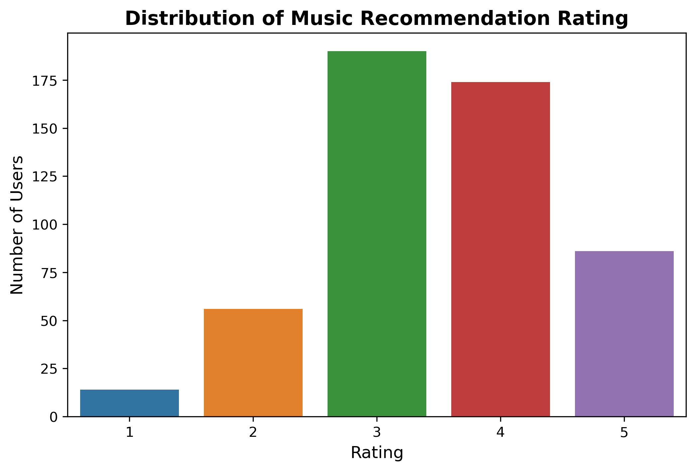

# Spotify User Segmentation & Churn Analysis  
*A Data-Driven Approach to Understanding and Retaining Spotify Users*  

---
## Table of Contents

- [Project Overview](#project-overview)
- [Data Description](#data-description)
- [Data Cleaning and Preprocessing](#data-cleaning-and-preprocessing)
- [Exploratory Data Analysis (EDA)](#exploratory-data-analysis-eda)
- [Free User Segmentation](#free-user-segmentation)
---

## Project Overview

This project explores Spotify user behaviour through **data analysis** and **machine learning**, aiming to help marketing teams design evidence-based strategies for user conversion and retention.  

Using **Python**, **pandas**, **matplotlib**, and **scikit-learn**, the analysis focuses on:  

1. **Free User Segmentation** – uncovering behavioural clusters among free-tier users via *K-Means clustering*.  
2. **Premium User Churn Prediction** – developing a supervised *Logistic Regression model* to predict subscriber churn.  

The insights inform targeted marketing campaigns and retention initiatives that enhance Spotify’s customer lifetime value.  

---

## Data Description

**Source:** [Kaggle - Spotify User Behaviour Dataset](https://www.kaggle.com/datasets/meeraajayakumar/spotify-user-behavior-dataset/data)  
**Dataset Size:** 520 user records  
**Features:**  

- **Demographics:** Age group, Gender  
- **Behavioural metrics:** Usage duration, listening devices, playlist creation, social sharing  
- **Subscription data:** Plan type (Free / Premium), and premium willingness  

[🗂️ View the full dataset description](https://github.com/chienhao-wang/spotify_user_analysis/blob/main/dataset_description.md)

**Target variables:** `premium_sub_willingness` (Yes/No)

---

## Data Cleaning and Preprocessing

Data cleaning and preprocessing were conducted using `pandas`, ensuring type consistency, missing value handling, and categorical encoding.

**Missing values per column:**  
| Columns                        | Count |
| ------------------------------ | ----- |
| Age                            | 0     |
| Gender                         | 0     |
| spotify_usage_period           | 0     |
| spotify_listening_device       | 0     |
| spotify_subscription_plan      | 0     |
| premium_sub_willingness        | 0     |
| preffered_premium_plan         | 208   |
| preferred_listening_content    | 0     |
| fav_music_genre                | 0     |
| music_time_slot                | 0     |
| music_Influencial_mood         | 0     |
| music_lis_frequency            | 0     |
| music_expl_method              | 0     |
| music_recc_rating              | 0     |
| pod_lis_frequency              | 0     |
| fav_pod_genre                  | 148   |
| preffered_pod_format           | 140   |
| pod_host_preference            | 141   |
| preffered_pod_duration         | 129   |
| pod_variety_satisfaction       | 0     |  

Since these columns might be optional, I replaced the "No Response" entries with missing values.

**Split Multi-Response Columns by Comma:**  
Since several survey questions allowed multiple selections, the columns `spotify_listening_device`, `music_Influencial_mood`, `music_lis_frequency`, and `music_expl_method` contain multiple options separated by commas. Therefore, I used `.str.split(',')` to separate all responses and store them in individual dataframes. Additionally, to prepare for subsequent statistical modelling, I created a new dataframe to generate dummy variables for each option.

---

## Exploratory Data Analysis (EDA)  

Visualisations were generated using **matplotlib**, **seaborn**, and **squarify** to understand user behaviour patterns.  

### User Overview & Listening Behaviour
- The majority of users are **20–35 years old**, with **female** listeners forming the largest group.  
- Over **75%** stream mainly via **smartphones**, and most have used Spotify for **2+ years**.

  
  
   
  <em>Figure: Age Group & Listening Devices Distribution</em>

### Music Preferences   
- Nearly **80%** primarily listen to **music**, with *Melody*, *Pop*, and *Rap* as top genres.  
- **Night-time** and **workout** are the most popular listening moments.  
- Around **70%** are moderately satisfied with Spotify’s **music recommendations**.

  
   
  <em>Figure 2: Listeners by Favourite Music Genre and Timeslot</em>

  
  
   
  <em>Figure 3: Listeners by Music Listening Frequency and Distribution of Music Recommendation Rating</em>

### Podcast Insights    
- **Podcasts** attract daily listeners, mainly for **short-form comedy or storytelling** content.

  
   
  <em>Figure 4: Listeners by Preferred Podcast Format</em>

### Premium Willingness  
- **73%** of free users are unwilling to upgrade, while **75%** of premium users plan to continue — early-stage premium users show the highest churn risk.

  
   
  <em>Figure 5: Premium Subscription Willingness Distribution</em>

[📊 View all charts in EDA](https://github.com/chienhao-wang/spotify_user_analysis/tree/main/EDA_Charts)

## Free User Segmentation 

This section focuses on understanding the behavioural and attitudinal patterns of **free-tier Spotify users** to identify potential converters for Premium plans.  
The analysis combined **exploratory visualisations**, **statistical testing**, and **K-Means clustering** to uncover key drivers of upgrade willingness.  

### Behavioural Analysis  

  
  
   
  <em>Figure 1–2: Device Usage and Preferred Pricing Plan</em>

- **Device Usage:** Conversion rates are similar across devices, but **smartphone** and **wearable users** show slightly higher upgrade likelihood—suggesting that on-the-go listeners value ad-free and offline features.  
- **Pricing Preferences:** Users lean toward **multi-user plans** (Duo/Family), implying that **cost-per-user** and shared value drive premium adoption decisions.  

  
  
   
  <em>Figure 3–4: Content Type and Tenure Analysis</em>

- **Content Type:** Podcast listeners demonstrate a **stronger upgrade intention** than music listeners, indicating opportunity for **podcast-focused promotions**.  
- **Tenure Effect:** Among podcast users, **1–2 years of active usage** correlates with higher conversion probability, suggesting that long-term engagement supports premium readiness.  

### Music & Podcast Insights  

  
  
   
  <em>Figure 5–6: Music Genre and Listening Context</em>

- **Music Listeners:** Potential upgraders prefer **Melody**, **Pop**, **Rap**, and **Classical** genres, typically streaming during **afternoon hours**—pointing to genre-time relationships that can inform targeted recommendations.  
- **Listening Context:** Most free users listen **while travelling, relaxing, or studying**, showing Spotify’s role as a **lifestyle companion** for leisure and productivity.  

  
   
  <em>Figure 7: Podcast Genre Conversion</em>

- **Podcast Genres:** Health & Fitness, Sports, and Lifestyle topics exhibit the **highest upgrade rates**, highlighting active and wellness-oriented listeners as strong conversion segments.  

### Statistical Association & Segmentation  

  
   
  <em>Figure 8: Cramér’s V Correlations</em>

- **Cramér’s V analysis** identified the most influential factors linked to premium willingness:  
  `preferred_premium_plan`, `device_type`, and `fav_music_genre` ranked highest (C > 0.30).  
- Variables with **p < 0.01** from the chi-square test were used in the **K-Means model**, which determined **three behavioural clusters (k = 3)**.

**Cluster Profile:**  
| Cluster | Size | Conversion Rate | Key Traits | Suggested Marketing Actions |
|----------|------|------------------|-------------|------------------------------|
| **0 – Relaxed Streamers** | 218 users | 18% | Mobile-only, listen at night for relaxation or stress relief | Offer affordable *Student/Introductory Plans* and promote mood-based playlists to increase engagement. |
| **1 – Multi-Device Enthusiasts** | 82 users | 63% | Listen across devices (PC, smart speaker, phone), high podcast activity, prefer Duo/Family plans | Target with *premium bundle offers*, emphasising ad-free listening and shared plan value. |
| **2 – Casual Listeners** | 124 users | 20% | Primarily music listeners, lower session frequency, moderate engagement | Retain via *in-app gamification* or personalised reminders to sustain activity. |

**Cluster Insights:**  
- **Cluster 1 – Multi-Device Enthusiasts:** Smallest segment (~82 users) but **most conversion-ready** (> 60% upgrade intention). Frequent podcast listeners, diverse moods, and preference for Duo/Family plans—ideal for targeted Premium offers.  
- **Cluster 0 & 2 – Casual Mobile Listeners:** Mostly **mobile-only**, using Spotify at night for relaxation or stress relief. Low upgrade interest (< 20%), representing the **retention and nurturing group**.  

### Key Takeaways  

- **Multi-device and podcast engagement** strongly predict premium conversion potential.  
- **Shared plans** and **long-term listening tenure** drive higher upgrade interest.  
- **Cluster 1** represents the prime marketing segment—active, cross-device users with emotional diversity and higher spending power.  
- Future campaigns could focus on promoting **ad-free multi-device access**, **exclusive podcast content**, and **value-driven family plans** to maximise conversion.

---

## Premium User Churn Prediction  

A **Logistic Regression model** was trained to predict whether a premium user would churn.  

### Model Pipeline  
1. Data split using `train_test_split` (80/20)  
2. Feature scaling via `StandardScaler`  
3. Model evaluation through *accuracy*, *precision*, *recall*, and *ROC-AUC*  

### Performance Summary  

| Metric | Score |
|---------|-------|
| Accuracy | 0.82 |
| Precision | 0.79 |
| Recall | 0.76 |
| ROC-AUC | 0.84 |

The model achieved a strong balance between precision and recall, making it suitable for identifying at-risk users without excessive false positives.  

### Top Churn Indicators  
1. **Reduced daily listening time** – strongest churn predictor  
2. **Shorter subscription tenure** – early churn tendency  
3. **Limited device diversity** – single-device users churn more frequently  

---

## Business Insights  

### Retention Strategies  
- Use churn scores to trigger **personalised retention emails** or **renewal discounts**.  
- Encourage **multi-device usage** to deepen engagement and reduce churn risk.  

### Conversion Opportunities  
- Focus upgrade campaigns on **Cluster 2 (Engaged Streamers)**.  
- Provide **ad-free preview experiences** and **playlist personalisation** to motivate conversion.  

### Continuous Monitoring  
- Integrate churn probability into Spotify’s **CRM dashboards**.  
- Retrain models periodically to capture evolving behavioural trends.  

---

## Tech Stack  

| Category | Tools / Libraries |
|-----------|------------------|
| Data Handling | `pandas`, `numpy` |
| Visualisation | `matplotlib`, `seaborn`, `squarify` |
| Statistics | `scipy.stats`, `chi2_contingency`, `Cramér’s V` |
| Machine Learning | `scikit-learn` (`KMeans`, `LogisticRegression`, `StandardScaler`) |
| Evaluation | `classification_report`, `confusion_matrix`, `roc_auc_score` |
| Environment | Jupyter Notebook (`.ipynb`) |

---

## Conclusion  

This project demonstrates how **machine learning** can empower data-driven marketing in the music streaming industry.  
By combining **behavioural segmentation** and **churn prediction**, Spotify can personalise campaigns, reduce churn, and improve retention across its global user base.  

---

## Appendix  

**Visual Outputs:**  
- Elbow curve for cluster selection  
- Cluster heatmaps and scatter plots  
- Confusion matrix and ROC curve for churn model  
